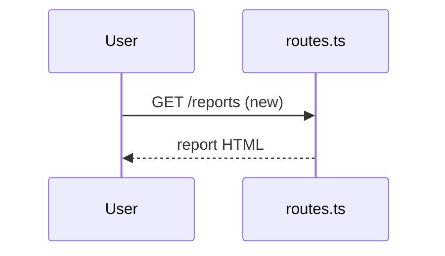

# Visual recap

A high-altitude review aid rendered by GitHub. It supplements the diff; it never
replaces reading it.

## Modes

- **Plan mode:** describe the intended change against the current system, in the
  plan or message.
- **Recap mode:** describe what the diff actually does. Replaces the plan block.

## Rules

1. Recap mode reads the diff, not memory: `git diff --stat <base>...HEAD` and
   `git diff <base>...HEAD`. Every claim must be checkable against the diff.
2. Classify with the script, then judge `composes` vs `extends` yourself:
   `node tools/classify-primitives.ts --base origin/main` (or
   `git diff --name-only … | node tools/classify-primitives.ts --stdin`).
3. Update
   [primitives.yaml](../../../docs/contributing/architecture/primitives.yaml)
   only when the change adds, removes, or reshapes a primitive.

## Risk

| Classification | Meaning                                      | Risk   |
| -------------- | -------------------------------------------- | ------ |
| `composes`     | Uses primitives as-is; wiring and call sites | Low    |
| `extends`      | Changes a primitive's behavior or contract   | Medium |
| `adds`         | New primitive (primitives.yaml updated)      | High   |

Roll up to the highest. Call out any touched `invariants` explicitly.

## Diagram

Prefer a mermaid **sequence diagram** of the request or job path, marking what
this change adds or alters on each hop. Use a flowchart only for fan-out or
many-to-many wiring. Keep it under ~15 nodes.

- Label every arrow with what crosses it (`App->>DB: insert fork_watch row`).
- Mark changed hops in the label (`(new)`, `(changed)`).
- No `;` inside labels; mermaid treats it as a statement break.
- `npm run docs:check-mermaid` validates diagrams in the repo; pipe a recap
  through `node tools/check-mermaid.ts --stdin` before posting it.

## Block format

The block lives in the PR description under `## System changes`, collapsed so it
does not crowd the description:

````markdown
<!-- recap:start -->
<details>
<summary><strong>System recap</strong> · extends (Medium) · invariants: none</summary>

**Mode:** recap · **Base:** `main` · **Head:** `abc1234`

| Primitive   | Change  | Notes                 |
| ----------- | ------- | --------------------- |
| http-server | extends | adds `/reports` route |



**Plan vs actual:** matches plan, or one line on what diverged and why.

</details>
<!-- recap:end -->
````

## Posting it

Write the block to a file and run:

```bash
node tools/upsert-recap-block.ts --pr <number> --file recap.md
```

The script validates the mermaid, then replaces only the text between the
markers in the PR body (or appends the block under `## System changes`). Never
hand-edit the PR body to update the recap.
