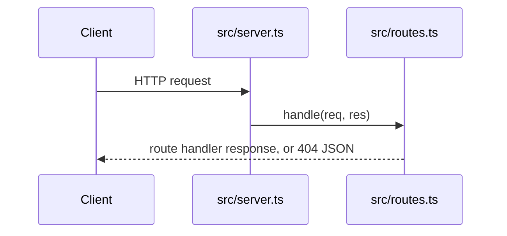

# Architecture

How the system is shaped. Keep this page short and link to one doc per primitive
as the product grows.

## Primitives taxonomy

[primitives.yaml](./primitives.yaml) is the stable vocabulary for the system's
building blocks. It is **not** a feature changelog.

- Every source file under `src/` must be owned by exactly one primitive's `code`
  root (longest prefix wins). `npm run primitives:check` enforces it.
- Classify a diff against it with
  `node tools/classify-primitives.ts --base origin/main`; `ship-pr` uses this to
  assess risk.
- Update the map only when a change **adds, removes, or reshapes** a primitive.
  Behavior detail goes in the linked `docs`, not in `summary`.
- `invariants` list properties every change must preserve. A diff touching a
  primitive with invariants calls them out in the PR description.

## Request lifecycle (placeholder app)

