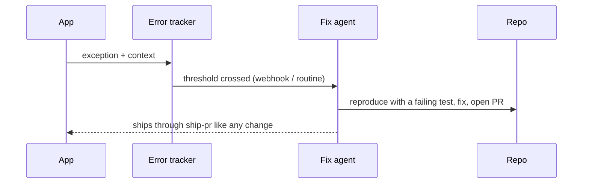

# Instrumentation

Agents can answer product questions from data only if the product records it.
Instrument early so decisions are evidence-based and failures heal themselves.

## Product analytics

Record events for the main user journeys and every failure path users can hit.
Before investing in a feature or fix, ask an agent to query production data: how
many users hit this pain, how often, and is it growing? Feed the answer into
`review-and-recommend`.

Rules:

- Event names are stable, `noun.verb` (`fork.update_detected`).
- No personal data in event payloads beyond an opaque user id.
- Document each event family next to the primitive that emits it.

## Errors as events

Production errors are captured with enough context to reproduce (route, flag
states, sha). Above a threshold, an error becomes an **event** that can start a
fix agent:

The fix agent follows the same harness (failing test first, `validate`, shipping
policy). It never hot-patches production.

## Usage metrics for cleanup

When an agent is not sure an old code path is safe to delete, it adds a counter
on that path instead of guessing. The legacy reaper deletes the path once the
counter shows no traffic for the window stated in the cleanup issue.
